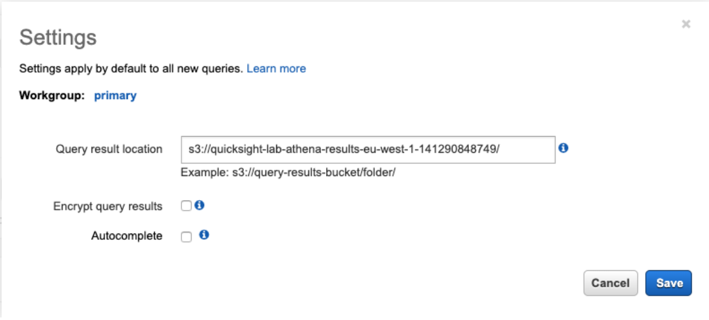
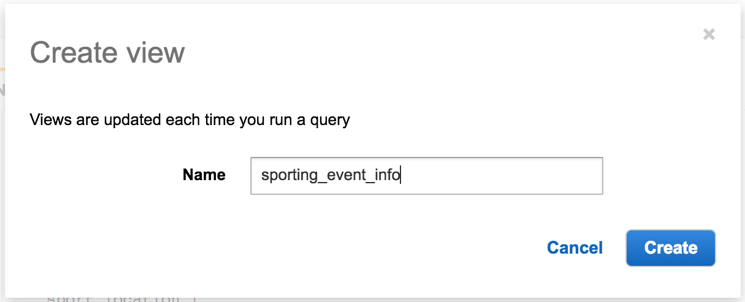

# Query Data with Amazon Athena

1. In the AWS services console, search for **Athena**.

    

2. If you are using Athena first time, click on “Get Started” button in introduction screen.

    

3. Athena stores query results in an Amazon S3 bucket and we should configure this before we can explore our dataset. There is already a bucket created for this purpose whose name follows the pattern: `quicksight-lab-data-lake-XXX-YYYY`.

    

4. To perform such configuration, in Athena Console, click on Settings.

    

5. Enter bucket name in the query result location field in the following format: `s3://<bucket-name>/` (slashes are important) and click on Save.

    

6. From the Query Editor tab, select your "ticketdata” database if not selected already.

7. Click the table named "parquet_sporting_event_ticket" to inspect the fields.

    > [!NOTE]
    > The type for fields id, sporting_event_id and ticketholder_id should be (double)

    <div style="text-align: center"></div>

    Next, we will query across tables parquet_sporting_event, parquet_sport_team, and parquet_sport location.

8. Copy the following SQL syntax into the New Query 1 tab and click Run Query.

    ```sql
    SELECT 
        e.id AS event_id,
        e.sport_type_name AS sport,
        e.start_date_time AS event_date_time,
        h.name AS home_team,
        a.name AS away_team,
        l.name AS location,
        l.city
    FROM parquet_sporting_event e,
        parquet_sport_team h,
        parquet_sport_team a,
        parquet_sport_location l
    WHERE 
        e.home_team_id = h.id 
        AND e.away_team_id = a.id 
        AND e.location_id = l.id;
    ```

    > [!NOTE]
    > If Run query button is not enabled, select the entire query and press Control + Enter to have it executed. This may happen in some browsers due to bug in this part of the web console. You can also re-load the page

    The results appear beneath the query window.

    

1. As shown above Click **Create** and then select **Create view from query**.

1. Name the view "sporting_event_info" and click **Create**.

    
    
    Your new view is created:

    
